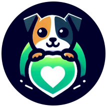
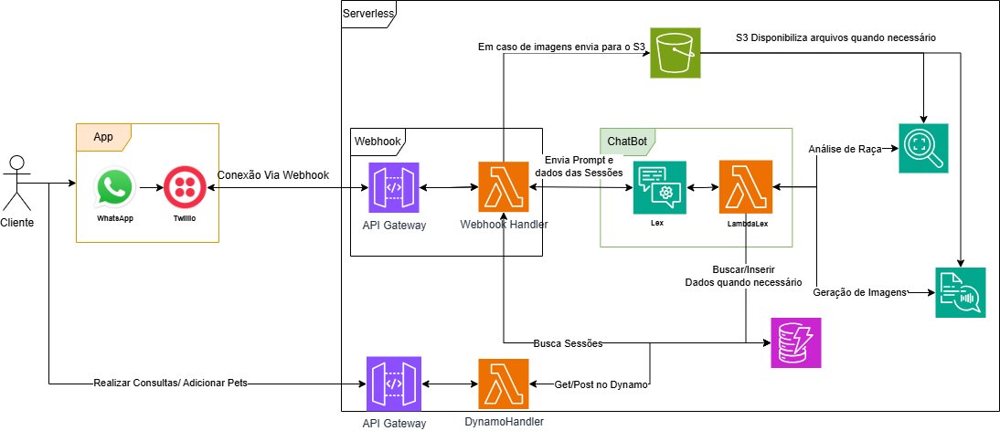

# Aumigo ChatBot

<p align="center">
  
</p>

## Objective/Purpose

This project aims to develop a chatbot to streamline the pet adoption process via WhatsApp. The solution seeks to automate and speed up the NGO's customer service, improving the experience for both the support team and prospective adopters. In the future, the chatbot will centralize and provide information about available pets, adoption requirements, and general guidelines, making the process more efficient and accessible. The goal is to reduce response times and optimize information flow, minimizing the workload for the NGO staff.

## Technologies Used

* **Lex**
* **Lambda**
* **Rekognition**
* **Polly**
* **DynamoDB**
* **S3**
* **API Gateway**
* **Serverless Framework**
* **AWS CLI**

## Current Project Architecture



## Folder Structure

```
  ├── .gitignore
  ├── README.md
  ├── assets/
  │   ├── logo.png
  │   ├── sprint-9-10.jpg
  ├── aumigo/
  │   └── Aumigo-DRAFT-90PY4XOH...
  ├──chatbot-serverless/
        ├── intents/
        │   ├── adotarPet.py
        │   ├── identificarCachorro.py
        │   ├── doacaoOng.py
        │   ├── novoCadastro.py
        │   └── verificacaoCadastro.py
        ├── services/
        │   ├── dynamo/
        │   │     ├── adopt_solicitations.py
        │   │     ├── lex_sessions.py
        │   │     ├── pets.py
        │   │     └── user.py
        │   ├── lex_service.py
        │   ├── polly_service.py
        │   ├── rekognition_service.py
        │   ├── s3_service.py
        │   └── webhook_service.py
        ├── utils/
        │   ├── dynamo_utils.py
        │   ├── lex_utils.py
        │   ├── polly_utils.py
        │   ├── rekognition_utils.py
        │   ├── s3_utils.py
        │   └── webhook_service.py
        ├── .env
        ├── .envExample
        ├── .gitignore
        ├── handler.py
        ├── package.json
        ├── serverless.yml
        └── README.md
```

## AWS CLI and Serverless Framework Environment Setup

### **1. Configure AWS CLI with SSO**

1. Install **AWS CLI**: Download and install from the [official website](https://aws.amazon.com/cli/).

2. Configure AWS CLI with SSO authentication:

   ```bash
   aws configure sso
   ```

   * Follow the prompts to enter:

     * **SSO Start URL**
     * **SSO Region**
     * **AWS Account**
     * **Permission Profile**
     * **Profile Name**

3. Test the configured profile:

   ```bash
   aws s3 ls --profile aumigo-profile
   ```

### **2. Deploy the Project with Serverless Framework**

1. Install the **Serverless Framework**:

   ```bash
   npm install -g serverless
   ```

2. Install project dependencies:

   ```bash
   cd chatbot-serverless
   npm install
   ```

3. Deploy the project:

   ```bash
   serverless deploy --profile aumigo-profile
   ```

## API Gateway Documentation

[SwaggerHub - ApiAumigo](https://app.swaggerhub.com/apis/JoaoHenriquedeOliveira/ApiAumigo/1.0.0)